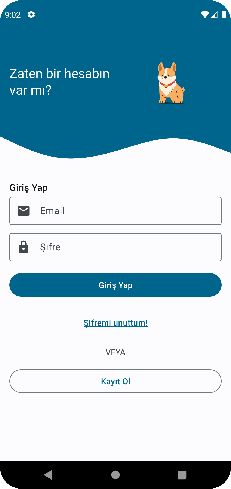

# I-LoveAnimals-App
This app provides that we can help animals in streets easily. We click an advertisement and see a map. And let's help these animals!

* <a href = "https://developers.google.com/maps/documentation/android-sdk"> Google Maps SDK </a>
* MVVM - ViewModel
* <a href="https://developer.android.com/guide/navigation"> Jetpack Navigation </a>
* <a href ="https://firebase.google.com/docs/auth/">Firebase authentication </a>
* <a href ="https://firebase.google.com/docs/firestore">Firebase Firestore </a>
* <a href = "https://developer.android.com/training/dependency-injection/hilt-android">Dagger-Hilt for Dependency injection</a>
* <a href="https://developer.android.com/topic/libraries/view-binding"> ViewBinding </a>
* <a href ="https://kotlinlang.org/docs/coroutines-guide.html">Coroutines-Flows-StateFlows-Channels </a>

| Login          | Register           | 
| ------------- |:-------------:|
| </img>     |  </img> |

|Home             | Order by date        | Filter with bottom sheet           |
| ------------- |:-------------:| -----:|
| </img> | </img>       | </img>  |

| Detail          | Map          | Post new advertisement           | 
| ------------- | ------------- |:-------------:|
| </img>     | </img>     |  </img> |

| Profile          | Changing Password Screen           | 
| ------------- |:-------------:|
| </img>     |  </img> |

## Video
https://youtu.be/FpAIIIk6bn8
